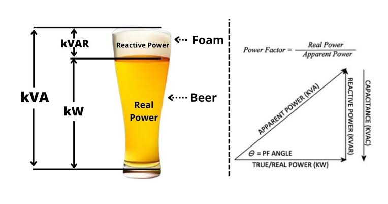

# Power-Factor-PFI--electrical

<!--[profile](./r.jpg)-->

## PFI

(1)... 1HP=746*(50HP)=37300/1000=37.30 KW [ 1000W=1KW]

power fector => cos-1(0.85)=31.7883

tan(31.7883)*37.30=23.1164 Kver [ যে ক্যাপাসিটর বারাতে হবে 23.1164]

